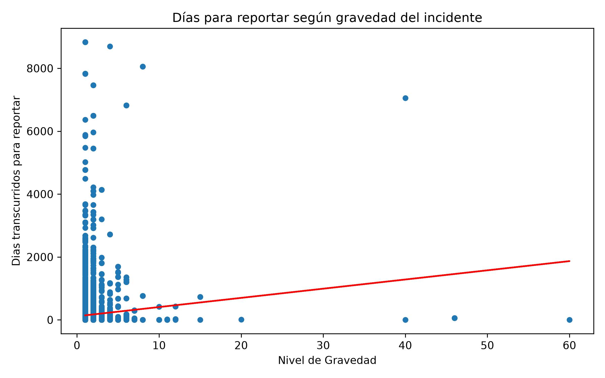
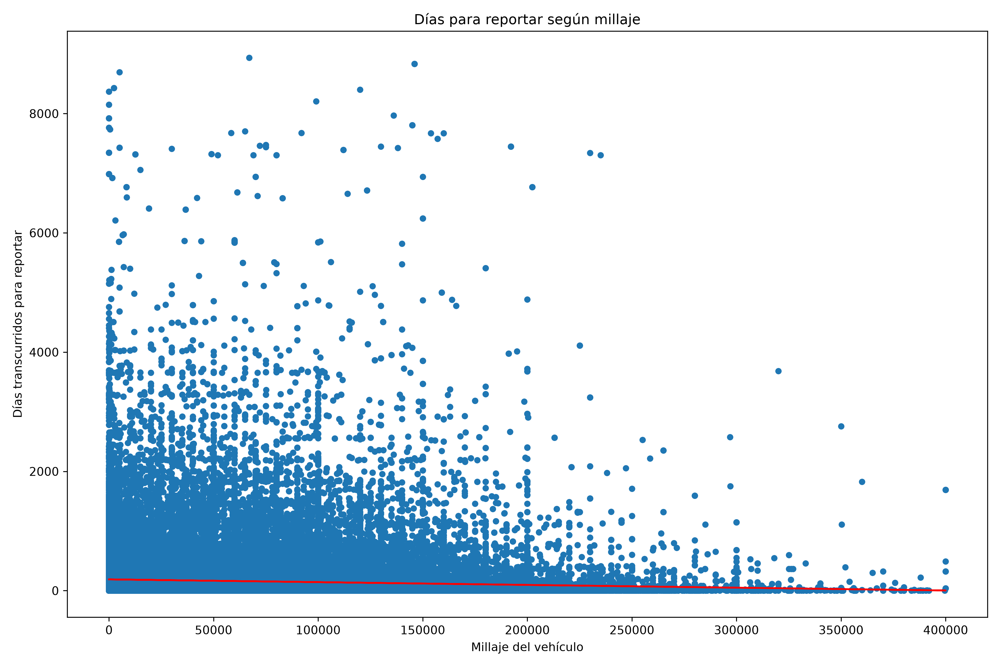
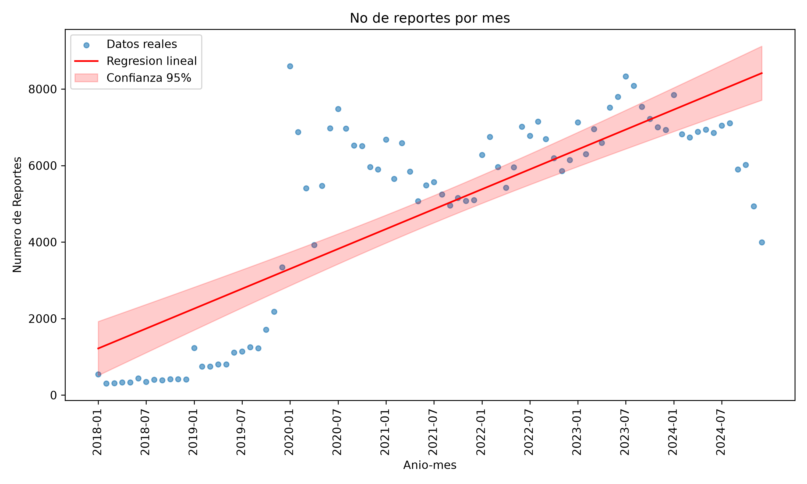

# Práctica 5 — Modelos Lineales y Correlación
## Minería de Datos | Dataset: NHTSA Consumer Complaints (2020–2024)

## 1. Objetivo

Generar un modelo lineal para al menos una relación entre variables del dataset, con su gráfica correspondiente y la métrica de R². En vez de correr un solo modelo, se probaron tres relaciones distintas para comparar qué tan bien o mal se ajusta una recta a cada una, siguiendo la misma lógica de la Práctica 4: no asumir de entrada que una variable predice bien a otra, sino comprobarlo con los números antes de escribir cualquier conclusión.

Como base para las tres regresiones se construyó una variable nueva, `dias_reporte`, que no existía en el dataset original: la diferencia en días entre `LDATE` (fecha en que NHTSA recibió la queja) y `FAILDATE` (fecha en que ocurrió el incidente).

```python
diferencia = (df['LDATE'] - df['FAILDATE']).dt.days
```

## 2. Qué se comparó y por qué

| Modelo | Variable X | Variable Y | Hipótesis detrás |
|---|---|---|---|
| 1 | Gravedad (INJURED + DEATHS) | dias_reporte | Pensado desde el punto de vista de una aseguradora: si alguien reporta un incidente grave mucho tiempo después, podría ser señal de fraude o de un trámite lento con el seguro antes de llegar a NHTSA |
| 2 | MILES | dias_reporte | La hipótesis inicial era que un auto con menos kilometraje, probablemente aún en garantía, se reportaría más rápido que uno viejo sin ese incentivo |
| 3 | Mes secuencial (2018–2024) | Número de quejas por mes | Ver si el volumen de quejas mensuales sigue una tendencia clara a lo largo del tiempo |

Para el Modelo 1, se filtró a solo los casos donde `gravedad > 0` (11,386 de 411,156 filas), ya que casi el 97% del dataset tiene gravedad cero y meterlos en la regresión hubiera aplastado cualquier relación real contra una nube enorme de ceros.

Para el Modelo 3, se agrupó `FAILDATE` por mes con `.dt.to_period('M')`, se contaron las quejas de cada mes, y se filtró a partir de enero de 2018, dejando fuera los meses anteriores donde solo había 1 o 2 quejas aisladas que no representan un patrón real.

## 3. Cómo se hizo

Los tres modelos se ajustaron con `statsmodels.api.OLS`, usando `sm.add_constant()` para que el modelo calculara también el intercepto, no solo la pendiente. La función se armó una sola vez y se reutilizó para los tres casos:

```python
def ajustar_regresion(df, x_col, y_col):
    x = sm.add_constant(df[x_col])
    modelo = sm.OLS(df[y_col], x).fit()
    return modelo
```

Cada gráfica muestra el scatter de los datos reales junto con la recta calculada a partir de `modelo.params`, y en el Modelo 3 además se agregó la banda de confianza al 95% usando `modelo.get_prediction().conf_int()`.

## 4. Modelo 1 — Gravedad vs. días para reportar



| Métrica | Valor |
|---|---|
| Observaciones | 11,386 |
| R² | 0.006 |
| Coeficiente (gravedad) | 29.21 |
| P>&#124;t&#124; | 0.000 |

El coeficiente dice que, en promedio, cada unidad adicional de gravedad (un herido o muerte más) se asocia con 29.2 días más de tardanza en el reporte. El p-value prácticamente en cero confirma que esa relación no es casualidad de la muestra. Pero el R² de 0.006 dice que la gravedad explica apenas el 0.6% de por qué unos casos se reportan rápido y otros tardan meses, así que aunque la relación existe, no sirve como predictor real.

La gráfica muestra por qué: la inmensa mayoría de los puntos está pegada entre gravedad 1 y 2 (8,428 y 2,135 de las 11,386 filas), con una cola larga y dispersa de casos raros hasta 60. La recta apenas alcanza a subir porque tiene que atravesar esa nube completamente vertical del lado izquierdo.

Antes de aceptar este resultado se probó también corriendo el mismo modelo sin los casos de gravedad 40, 46 y 60, para ver si esos outliers eran los que estaban distorsionando todo. El coeficiente cambió de 29.21 a 28.06, y el R² bajó de 0.006 a 0.002, prácticamente sin cambio real. Eso confirma que el problema no son unos cuantos casos extremos, es que la relación es débil en toda la escala, así que se reporta el modelo completo sin filtrar como el resultado final de esta comparación.

Para una aseguradora, la conclusión práctica sería que la gravedad del incidente, por sí sola, no sirve para anticipar reportes tardíos sospechosos. Si existiera un patrón de fraude relacionado con el tiempo de reporte, esta variable no lo está capturando.

## 5. Modelo 2 — Millaje vs. días para reportar



| Métrica | Valor |
|---|---|
| Observaciones | 149,073 |
| R² | 0.004 |
| Coeficiente (millaje) | -0.0005 |
| P>&#124;t&#124; | 0.000 |

Aquí el coeficiente contradice la hipótesis inicial. Se esperaba que a menor millaje (auto en garantía) el reporte fuera más rápido, es decir, una relación positiva entre millaje y días de reporte. Salió negativa: a mayor kilometraje, el reporte tiende a llegar un poco más rápido, no más lento. Por cada 100,000 millas de diferencia, el modelo predice apenas 50 días menos de tardanza, un efecto mínimo.

El R² de 0.004 es todavía más bajo que el del Modelo 1, el millaje explica solo el 0.4% de la variación en días de reporte. La gráfica muestra una forma de abanico que se cierra hacia la derecha: en millajes bajos hay puntos dispersos en todo el rango de días de reporte, incluyendo varios casos que tardaron miles de días, mientras que en millajes altos casi todos los puntos se aplanan cerca de cero días.

Conclusión: el millaje del vehículo no predice de forma útil cuánto tarda alguien en reportar una falla, y el signo del efecto va al revés de lo que parecía intuitivo antes de correr el modelo.

## 6. Modelo 3 — Tendencia de quejas por mes



| Métrica | Valor |
|---|---|
| Observaciones (meses) | 84 |
| R² | 0.628 |
| Coeficiente (x) | 86.69 |
| P>&#124;t&#124; | 0.000 |

Este es el único de los tres modelos con poder explicativo real. El R² de 0.628 dice que el 62.8% de la variación en el número de quejas mensuales se explica solo por el paso del tiempo. El coeficiente de 86.69 significa que, en promedio, cada mes que pasa trae 86.69 quejas más que el mes anterior, dentro de esta tendencia general de 2018 a 2024.

La gráfica muestra la dispersion de puntos junto con la línea de tendencia y su banda de confianza al 95%. Se ve un salto marcado a partir de 2020, y aunque hay meses que suben y bajan alrededor de la línea, la dirección general creciente es clara y consistente durante los cinco años.

Dos explicaciones posibles para este crecimiento, ninguna confirmable solo con este dataset:

- Reportar una falla a NHTSA se ha vuelto más accesible con el tiempo (aplicación móvil, formulario web), lo que podría estar inflando el número de reportes sin que haya necesariamente más fallas reales ocurriendo.
- El número de autos en circulación ha crecido, y con él, el número de fallas reales. Confirmar esta hipótesis necesitaría datos externos de ventas de vehículos por año, que no forman parte de este dataset.

Probablemente ambos factores contribuyen a la vez, pero no hay forma de separar cuánto le corresponde a cada uno con la información disponible aquí.

## 7. Resumen comparativo

| Modelo | R² | ¿Predice bien? |
|---|---|---|
| Gravedad → días de reporte | 0.006 | No |
| Millaje → días de reporte | 0.004 | No |
| Tiempo → número de quejas mensuales | 0.628 | Sí |

Los dos primeros modelos, aunque estadísticamente significativos por el tamaño de la muestra, tienen un poder predictivo casi nulo. El tercero es el único que muestra una relación con fuerza real. Esto conecta con el mismo patrón visto en la Práctica 4 con el eta cuadrado: un p-value bajo no equivale a un efecto grande, y con cientos de miles de observaciones casi cualquier pendiente distinta de cero termina saliendo significativa.

## 8. Limitaciones

Los tres modelos son regresiones lineales simples con una sola variable explicativa. Ninguno controla por otros factores que podrían influir al mismo tiempo, como el tipo de componente que falló, la marca, o si hubo choque.

El Modelo 3 tiene apenas 84 observaciones (una por mes), que es un tamaño de muestra chico comparado con los otros dos. El R² alto ahí se calcula sobre esos 84 puntos, no sobre las 411,156 quejas individuales.

Ninguno de los tres modelos permite hablar de causalidad. Que el tiempo se relacione fuertemente con el número de quejas no dice por sí solo si es por más fallas reales, más facilidad para reportar, o ambas cosas.

## 9. Nota sobre uso de IA

Este código se desarrolló bajo la modalidad de Pair Programming (Conductor/Navegante) permitida por el curso: la lógica y las decisiones fueron mías; la IA se usó para depurar errores puntuales, sugerir sintaxis o librerías, y hacer preguntas guía. Ningún hallazgo ni interpretación final salió de la IA sin pasar antes por esa verificación directa contra los datos.
