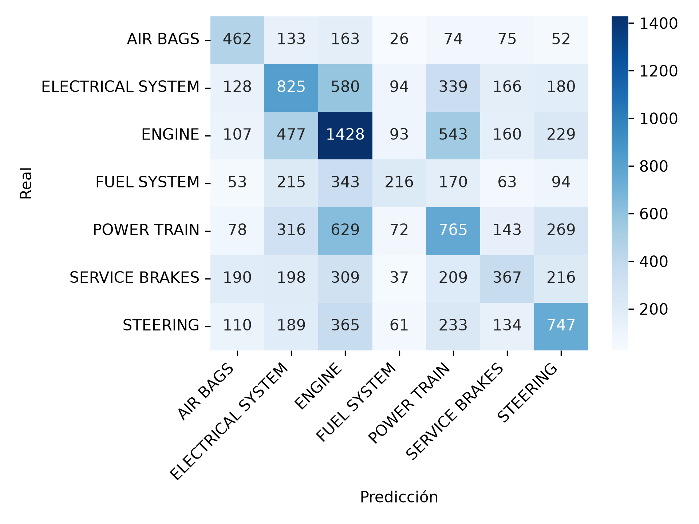

# Práctica 6 — Clasificación de Datos (KNN)
## Minería de Datos | Dataset: NHTSA Consumer Complaints (2020–2024)

## 1. Objetivo

Crear y evaluar un modelo de clasificación usando K Vecinos Más Cercanos (KNN) para predecir `COMP_MAIN` (categoría principal del componente que falló), la columna derivada en la Práctica 1 a partir de `COMPDESC`. Más allá de cumplir el requisito de la práctica, el objetivo real detrás de este modelo era evaluar si se podía usar para rellenar `COMP_MAIN` en los registros donde ese campo llegó como `UNKNOWN` a NHTSA. 

## 2. Selección de variables y preparación de datos

Se seleccionaron como features `MAKETXT`, `YEARTXT`, `MILES`, `VEH_SPEED`, `CRASH` y `FIRE`. `CRASH` y `FIRE` se convirtieron de `Y`/`N` a binario (1/0). `MAKETXT` se redujo a las 20 marcas más frecuentes, agrupando el resto bajo `OTHER`, y se codificó con one-hot encoding (`drop_first=True`).

Se limitó el problema a las 7 categorías más frecuentes de `COMP_MAIN` (AIR BAGS, ELECTRICAL SYSTEM, ENGINE, FUEL SYSTEM, POWER TRAIN, SERVICE BRAKES, STEERING), descartando el resto de categorías minoritarias y los registros `UNKNOWN` (que se apartaron en `df_unknown`, sin usar en el entrenamiento).

### Columnas adicionales evaluadas y descartadas

Antes de fijar el set final de features, se evaluó agregar seis columnas más del dataset relacionadas mecánicamente con los componentes a clasificar: `NUM_CYLS`, `FUEL_SYS`, `FUEL_TYPE`, `TRANS_TYPE`, `ANTI_BRAKES_YN`, `CRUISE_CONT_YN`.

- `NUM_CYLS` no existe en `nhtsa_clean.csv`: se eliminó en la Práctica 1 por tener 93.6% de nulos.
- `FUEL_SYS`, `FUEL_TYPE`, `TRANS_TYPE` tenían más del 50% de nulos en el dataset original y en la Práctica 1 se rellenaron con el texto `"No aplica"`. Se confirmó que esa proporción de "No aplica" se mantiene altísima: 99.9%, 93.2% y 99.6% respectivamente. Con tan poca variación real, no le aportan poder discriminativo al modelo.
- `ANTI_BRAKES_YN`, `CRUISE_CONT_YN` no tenían nulos en el dataset limpio, pero su distribución real resultó igual de desbalanceada: 99.66% `N` y 99.54% `N` respectivamente. El mismo argumento aplica — una columna donde más del 99% de las filas comparten el mismo valor no le da al modelo ninguna superficie real para separar clases.

Se descartaron las seis columnas por este motivo.

## 3. Entrenamiento del modelo baseline

- `StandardScaler` sobre las features antes de entrenar, necesario porque KNN clasifica por distancia entre puntos y una variable en escala mucho mayor (como `MILES`) dominaría el cálculo si no se normalizan todas a la misma escala.
- `train_test_split` con `test_size=0.2`, `random_state=42` y `stratify=y`, para que la proporción de cada una de las 7 clases se mantenga igual entre entrenamiento y prueba (sin esto, el split aleatorio podía dejar por azar un poco más o menos de alguna clase minoritaria en el test set, afectando la comparación entre corridas).
- `k=31` vecinos.

## 4. Resultados del modelo baseline

| Métrica | Valor |
|---|---|
| Accuracy | 0.37 |
| Macro avg F1 | 0.35 |
| F1 — FUEL SYSTEM | 0.25 |
| F1 — ENGINE | 0.42 |

La matriz de confusión muestra que las clases con más confusión entre sí son ENGINE, POWER TRAIN y ELECTRICAL SYSTEM: por ejemplo, de los registros reales de POWER TRAIN, 629 se predijeron como ENGINE. Esto es consistente con que son sistemas mecánicamente relacionados en un vehículo real (una falla de motor puede compartir síntomas — millaje, velocidad al momento del incidente — con una falla de tren motriz), y las features usadas (marca, año, millaje, velocidad, choque, fuego) no capturan la diferencia específica entre esos sistemas.

FUEL SYSTEM es la clase con peor desempeño (recall 0.19), la mayoría de sus registros reales se predicen como ENGINE o ELECTRICAL SYSTEM.

## 5. Alternativas evaluadas y descartadas

Dado que el objetivo era usar el modelo para rellenar `df_unknown`, se probaron dos estrategias para mejorar específicamente el desempeño en las clases minoritarias antes de aceptar el baseline como resultado final.

### 5.1 — SMOTENC (oversampling sintético)

Se armó un pipeline (`imblearn.pipeline.Pipeline`) con `StandardScaler` → `SMOTENC` (respetando las columnas de marca como categóricas, vía `categorical_features`) → `KNeighborsClassifier`, con `k=31` fijo, para generar registros sintéticos de las clases minoritarias hasta igualarlas en tamaño a la clase mayoritaria (ENGINE).

| Métrica | Valor |
|---|---|
| Accuracy | 0.34 |
| Macro avg F1 | 0.34 |
| F1 — FUEL SYSTEM | 0.26 |

El recall de FUEL SYSTEM mejoró (de 0.19 a 0.35), pero su precision empeoró (de 0.36 a 0.21), y el accuracy y macro avg globales bajaron respecto al baseline. El modelo "atrapa" más casos de FUEL SYSTEM, pero a costa de equivocarse más al asignar esa etiqueta a registros que en realidad son de otra clase, y de empeorar el desempeño de clases mayoritarias como ENGINE (su recall bajó de 0.47 a 0.30).

### 5.2 — GridSearchCV sobre k y weights (con SMOTENC)

Sobre el mismo pipeline con SMOTENC, se usó `GridSearchCV` (`cv=5`, `scoring='f1_macro'`) para probar `k` en `[5, 15, 25, 31, 41]` combinado con `weights` en `['uniform', 'distance']` (10 combinaciones, 50 entrenamientos totales).

La combinación ganadora fue `k=41, weights='uniform'`, con `f1_macro` de 0.345 en validación cruzada.

| Métrica | Valor |
|---|---|
| Accuracy | 0.34 |
| Macro avg F1 | 0.34 |

El resultado fue prácticamente idéntico al de SMOTENC con `k=31` fijo, y sigue por debajo del baseline en accuracy y macro avg.

### 5.3 — Conclusión de las alternativas

Tanto SMOTENC como la búsqueda de hiperparámetros atacan el desbalance de clases (cuántos registros hay de cada una), pero el problema identificado en la matriz de confusión del baseline no es de cantidad de datos, es de solapamiento real entre categorías mecánicamente relacionadas dado el set de features disponible. Generar más registros sintéticos de FUEL SYSTEM no le da al modelo ninguna información nueva para distinguirlo de ENGINE si las features (millaje, velocidad, marca, año, choque, fuego) no separan bien esas dos categorías en primer lugar. Por este motivo se descartaron ambas alternativas y se mantiene el modelo baseline (sin balanceo, `k=31`) como resultado final de la práctica.

## 6. Sobre `df_unknown`

Los registros con `COMP_MAIN == 'UNKNOWN'` se separaron del entrenamiento desde el inicio (`df_unknown`) con la intención de usarlos como objetivo de predicción una vez que el modelo tuviera un desempeño confiable. Dado que el mejor resultado obtenido (accuracy 0.37, macro avg F1 0.35) no ofrece suficiente confiabilidad para asignar etiquetas que después se traten como dato real, se decidió no rellenar esta columna en la Práctica 6.

## 7. Limitaciones

El set de features usado (marca, año, millaje, velocidad, choque, fuego) no incluye ninguna variable que describa directamente el sistema mecánico involucrado — las columnas del dataset que sí lo hacían (`FUEL_SYS`, `FUEL_TYPE`, `TRANS_TYPE`, `ANTI_BRAKES_YN`, `CRUISE_CONT_YN`) resultaron inutilizables por su falta de variación real. Esto limita de raíz cuánto puede distinguir el modelo entre componentes mecánicamente relacionados, independientemente del algoritmo o las técnicas de balanceo usadas.

## 8. Nota sobre uso de IA

Este código se desarrolló bajo la modalidad de Pair Programming (Conductor/Navegante) permitida por el curso: la lógica y las decisiones fueron mías; la IA se usó para depurar errores puntuales, sugerir sintaxis o librerías (SMOTENC, GridSearchCV, Pipeline de imblearn). Ningún hallazgo ni interpretación final salió de la IA sin pasar antes por esa verificación directa contra los datos.
